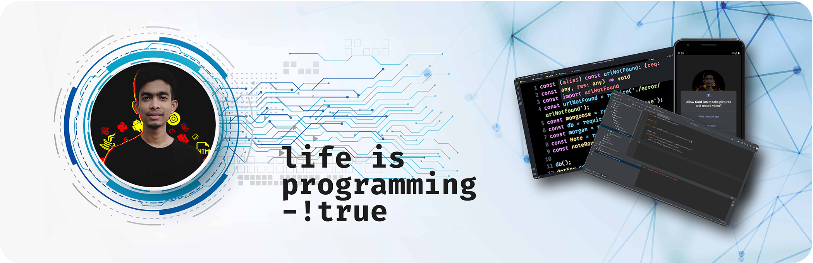

### Hi there 👋 Welcome

# Shahoriar Ahmed Shuvo

I'm a <b>web developer</b> & <b>designer</b> focused on crafting clean & user‑friendly experiences, I am passionate 🚀 about building excellent 🔥 software that improves the lives of those around me.👀

- 🔭 I’m currently looking for a job 
- 🌱 I’m currently learning go lang 
- 💬 Ask me about Web Development

 

## ✉️ Reach out to me

 

## ⚡ Tech Stack

### 🚀 Languages

### 🧩 Libraries & Framework

### 🧑🏻‍💻 Tools & Platform

### 💻 Workspace

-FCC624?style=for-the-badge&logo=linux&logoColor=white)

 

## 📈 Stats

 

 

## 🔝 Most used languages

  

# Thank you.
 
 

  

