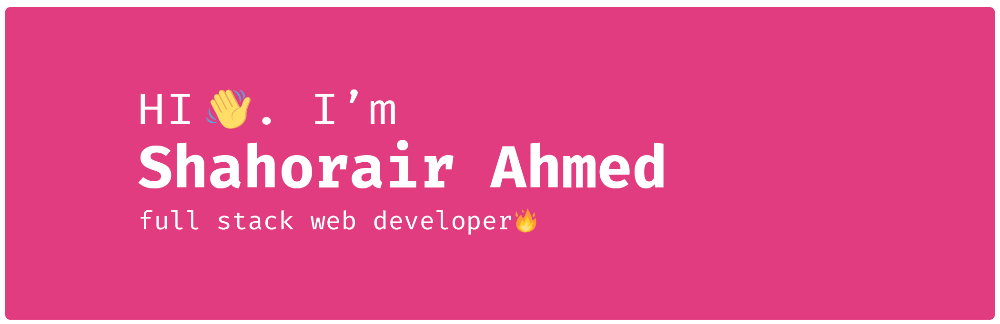

### Hi there 👋

# Shahoriar Ahmed Shuvo
I'm Shahoriar Ahmed Shuvo from Bangladesh, Rajshahi, and I'm a web designer & front‑end developer focused on crafting clean & user‑friendly experiences, I am passionate about building excellent software that improves the lives of those around me.

## Skills and Experience
* 📱 Java Android
* ⚛ React
* 👨‍💻 Node js
* 💻 HTML, CSS, JS

## 📈 Stats

 
  

## 🔝 Most used languages

  

# Thank you.

<!--
**devshahoriar/devshahoriar** is a ✨ _special_ ✨ repository because its `README.md` (this file) appears on your GitHub profile.

Here are some ideas to get you started:

- 🔭 I’m currently working on ...
- 🌱 I’m currently learning ...
- 👯 I’m looking to collaborate on ...
- 🤔 I’m looking for help with ...
- 💬 Ask me about ...
- 📫 How to reach me: ...
- 😄 Pronouns: ...
- ⚡ Fun fact: ...
-->
